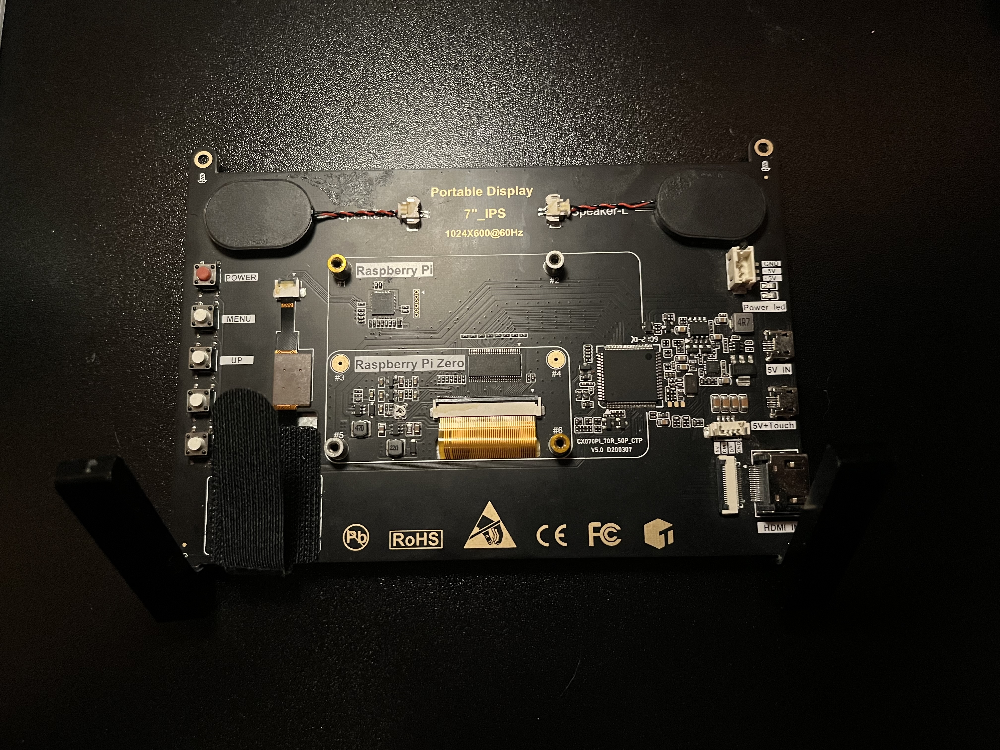
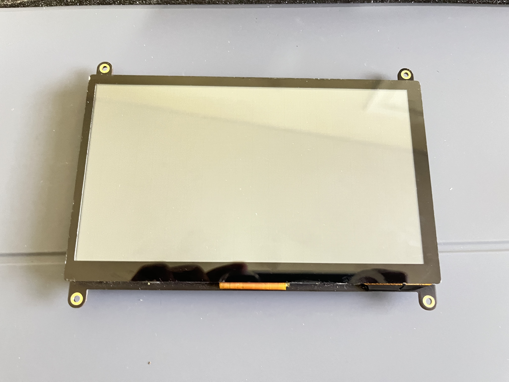

<!-- TODO: Add an image showing the Raspberry Pi 7" Touchscreen assembled with a Raspberry Pi

-->



## Raspberry Pi 7" Touchscreen Setup

This guide covers how to assemble and set up the official Raspberry Pi 7" touchscreen display. It includes references to 3D printed cases and mounts that can be used with this touchscreen.

### What You'll Need
- [Raspberry Pi]() (any model works with the touchscreen)
- [Portable Display 7" Touchscreen Monitor](https://) (1024x600@60Hz)
- [Official Raspberry Pi 7" Touchscreen Display](https://)
- HDMI cable (choose one)
  -  [Standard HDMI cable](https://) (can be used with a micro/mini HDMI adapter if needed)
  - [HDMI ribbon cable](https://) (included with the touchscreen)
- [Raspberry Pi power supply](https://) (compatible with your Raspberry Pi model)
- [Micro USB cable for the touchscreen](https://) (can be powered from the RPi or a separate power source)

### Setting Up the Touchscreen

Setting up the touchscreen involves connecting the display to the Raspberry Pi 
is a straightforward process.

Here's how to do it:

<!-- TODO: Add a GIF demonstrating the step-by-step assembly process

-->


1. **Connect the HDMI Cable or Ribbon Cable**
   - Plug the HDMI cable into the HDMI port on the Raspberry Pi
   - Connect the other end of the HDMI cable to the HDMI port on the touchscreen
    - If using the HDMI ribbon cable, connect it to the display and the Raspberry Pi 

2. **Connect the Touchscreen Power**
    - Connect the micro USB cable to the touchscreen
    - Power the touchscreen using the Raspberry Pi or a separate power source
- **Note:** The touchscreen can be powered from the Raspberry Pi, but it may require a separate power source for optimal performance.

3. **Mount RPi to Screen**
   - Place RPi on back of screen, aligning the display connectors
   - Secure RPi with the 4 included screws (M2.5x12mm screws) for a secure fit.
4. **Connect the Touchscreen to the Raspberry Pi**
   - Connect the touchscreen cable to the Raspberry Pi's micro-usb port or built-in port on the back of the screen.

- **Note:** Make sure the cable is securely connected and aligned with the port

You can now power on the RPi and the touchscreen should be working!

### Install Touchscreen Keyboard
After setting up your Raspberry Pi with the touchscreen, you may want to install a touchscreen keyboard for easier input.

To use the touchscreen fully and avoid having to use an external keyboard for use, install a keyboard:

---
```bash
sudo apt-get install matchbox-keyboard
sudo reboot
```
---

The keyboard can now be accessed from the menu or by running `matchbox-keyboard` in the terminal.

<!-- TODO: Add a GIF showing the touchscreen keyboard in use

-->


### 3D Printed Cases

<!-- TODO: Add an image showcasing various 3D printed mounts for the Raspberry Pi Touchscreen

-->


For a sleek enclosure, there are several 3D printed cases available for this touchscreen:

- [Raspberry Pi 7 Inch Touchscreen display case](https://www.printables.com/model/18153-raspberry-pi-7-inch-touchscreen-display-case) on Printables[9] 
- [Raspberry Pi 7 Inch Touchscreen display case](https://www.thingiverse.com/thing:1585924) on Thingiverse[10]

These cases have a slim design while allowing access to all ports.

### 3D Printed Mounts

To mount the touchscreen on a wall or connect it to a GoPro-style mount, you can 3D print one of these mounts:

- [Wall Mount Touch Screen Raspberry Pi](https://www.stlfinder.com/3dmodels/wall-mount-touch-screen-raspberry-pi/) on STLFinder[11]
- [Raspberry Pi 3 Touchscreen Wall Mount](https://www.etsy.com/listing/1045534495/raspberry-pi-3-touchscreen-wall-mount) on Etsy[12]

These mounts have pre-holed slots that fit all Raspberry Pi models, allowing you to easily wall-mount the touchscreen or connect it to a GoPro-style mount.

With these instructions and 3D printed accessories, you'll have a great touchscreen setup for your Raspberry Pi projects!
--->
## References


### Extra Resources
